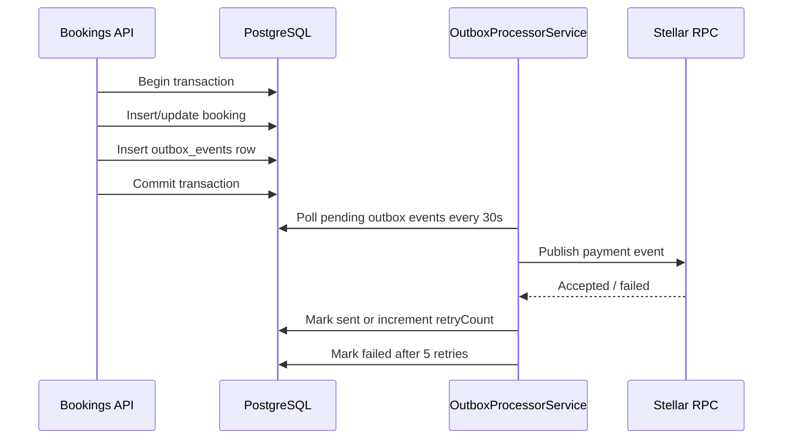

# Stellar Payment Outbox Flow

The booking write and outbox event insert commit atomically. Stellar RPC failures do not roll back the booking row; the worker retries pending events until the retry limit is reached.
