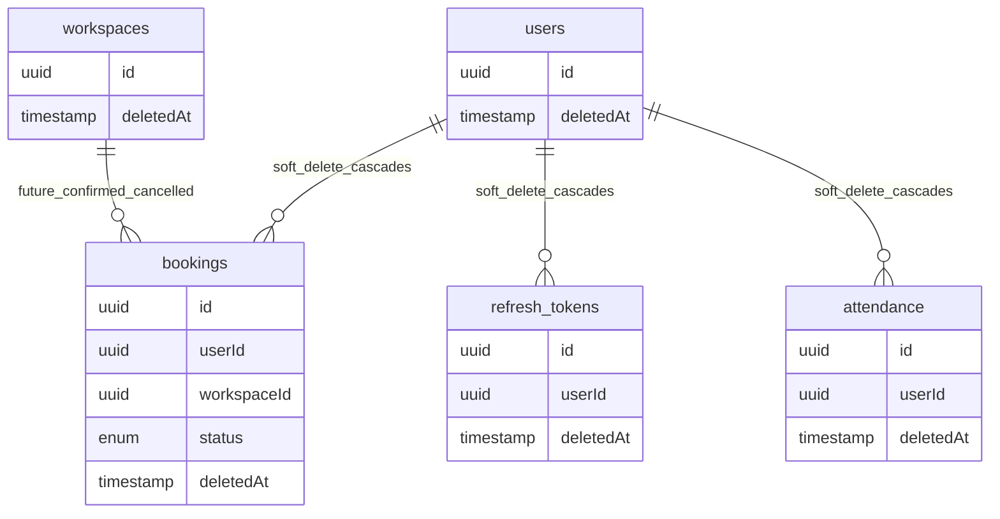

# Soft-Delete Cascade Rules

User soft-delete cascades to bookings, refresh tokens, and attendance records. Workspace soft-delete preserves booking history and cancels only future confirmed bookings.
