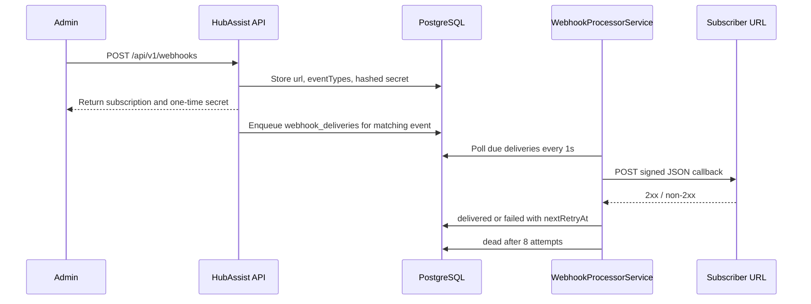

# Webhook Delivery Lifecycle

```mermaid
sequenceDiagram
  participant Admin
  participant API as HubAssist API
  participant DB as PostgreSQL
  participant Worker as WebhookProcessorService
  participant Target as Subscriber URL

  Admin->>API: POST /api/v1/webhooks
  API->>DB: Store url, eventTypes, hashed secret
  API-->>Admin: Return subscription and one-time secret
  API->>DB: Enqueue webhook_deliveries for matching event
  Worker->>DB: Poll due deliveries every 1s
  Worker->>Target: POST signed JSON callback
  Target-->>Worker: 2xx / non-2xx
  Worker->>DB: delivered or failed with nextRetryAt
  Worker->>DB: dead after 8 attempts
```

Retries use exponential backoff in seconds: `1, 2, 4, 8, 16, 32, 64, 128`.
